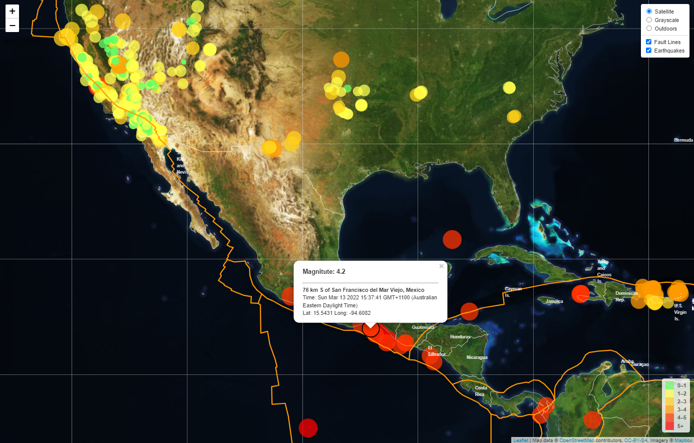

# The Quest: Visualising LIVE Earthquake Data with Leaflet
   Want know what happened to earthquake activities around the world in the last 7 days? You came to the right place!
   
   I created a web page that pulls data from the [USGS website](http://earthquake.usgs.gov/earthquakes/feed/v1.0/geojson.php) for visualisation.
   
   The USGS website provides earthquake data in geoJSON formats, updated every 5 minutes. I used API endpoint for past 7 days to pull in the data and plotted earthquake data as markers on the map based on their longitude and latitude:  
   

I used Leaflet and D3 to create [this web page](https://realdreammaker.github.io/Live-Earthquake-Checker/), see [javascript](static/js/logic.js) for more details
(a mapbox account is required for the map layers to display properly)

##  Map features:
   * Data markers reflect the magnitude of the earthquake in their size and colour
   * Included popups that provide additional information about the earthquake when a marker is `clicked / hovered over`.
   * A legend that will provide context for map data (see bottom right).
   * Pull a [second data set](https://github.com/fraxen/tectonicplates) on the map to illustrate the relationship between tectonic plates and seismic activity (see orange lines - Fault lines). 
   * Three base-map layers to choose from as well as separate out earthquake data and tectonic plates into overlays that can be turned on and off independently.
   * When the satellite map layer is selected:
      1. A layer that includes countries' name and boundary will show on the map.
      2. Markers will change in style/behaviour accordingly 

 

 

        
- - -

## To run my webpage
1. Fork this repository to local server
2. Create an API key from [mapbox](https://account.mapbox.com/auth/signup/?route-to=%22https://account.mapbox.com/%22)
3. Enter your API_KEY to [config.js](./config.js) file
4. Run index.html in live server or in Terminal, run `python -m http.server`

   
